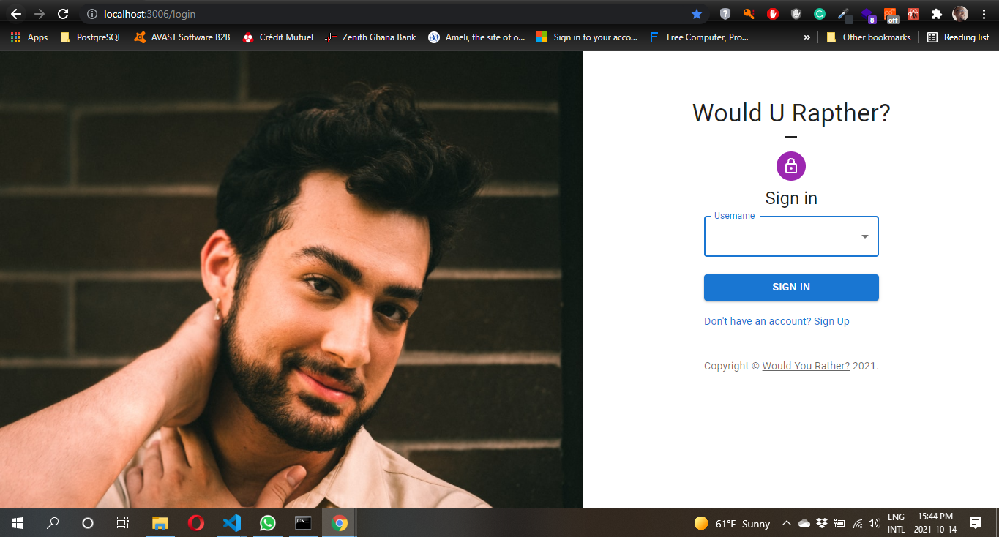
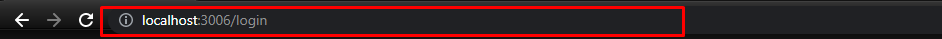
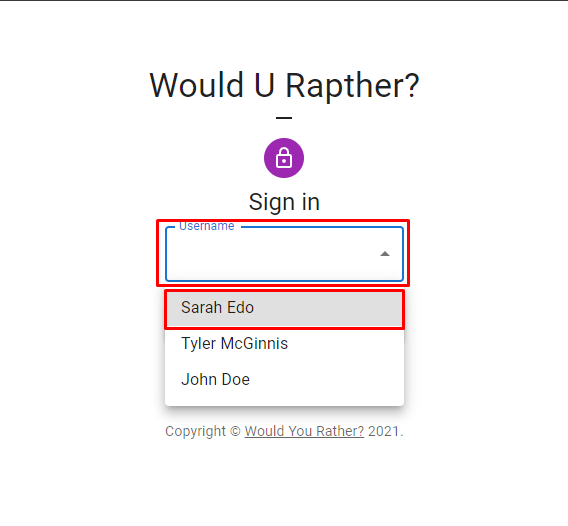
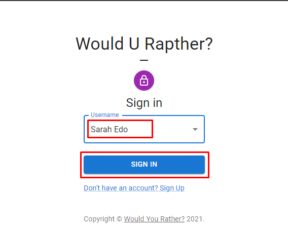
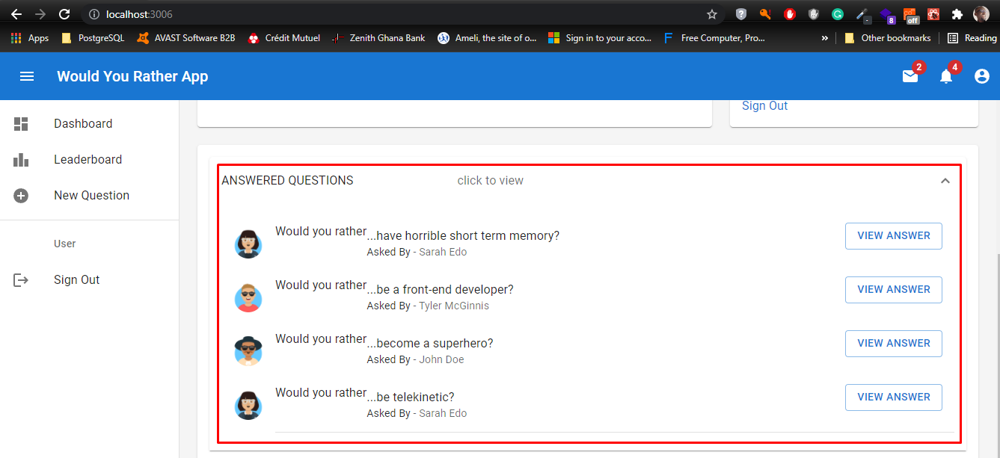
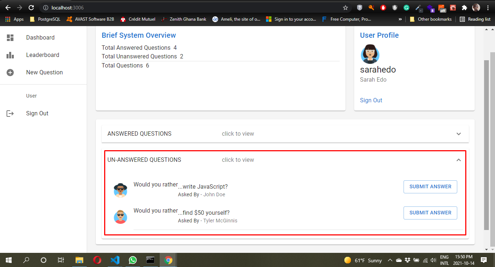
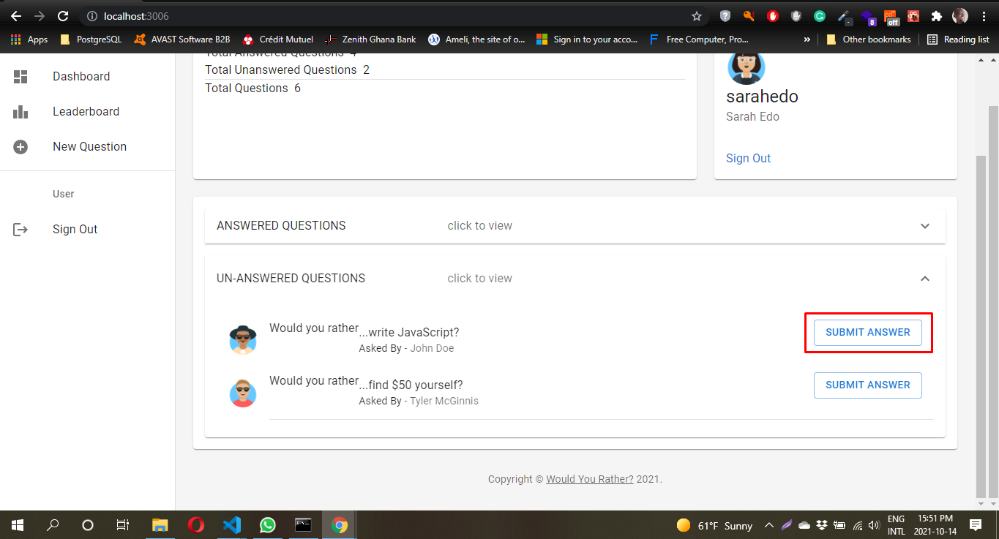
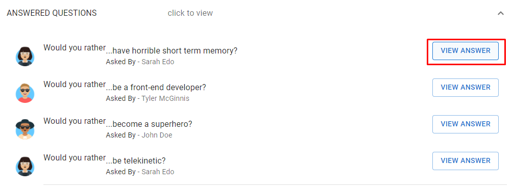

# Would You Rather...?

This is a project to showcase how states are handled in React using React and Redux.

## Essence of the App:

The App is a 2nd project out of 3 in a path I am following at Udacity title React Nanodegree. It is intended to showcase how a whole App can be broken into components for reuseable and to adhere to DRY (Don't Repeat Yourself) and other principles with the main focus on React and Redux to manage states.

## Loading the App

The project uses the Create-React-App in creating the starter template. 
The `create-react-app` command can be issued at your favourite command line tool only when Node is installed or you can use npm.

Clone the app from my GitHub repo using the command 
```git clone https://github.com/bafrimpong/would_you_rather_app.git && npm install```

When all the dependencies are installed, launch the app with

```
npm start
```
OR
```
yarn start
```

Your default browser window will open showing the app contents. If it doesn't, just enter [http://localhost:3000/](http://localhost:3000/) in your browser to launch it. The app by default will redirect you to the Signin page
 Note: The image on the main page is not static since the source is dynamically retrieve from a website

## How to Use the App

- When the App starts by entering the address or after executing `yarn or npm start` from your console app you are presented with the Sign-in screen.
   
- Select your `username` from the list of users in the dropdown list  as shown.
- Now click on the Sign button to authenticate the selected user name to continue using the app. 
 *  Please note that I have set port for this app to 3006 since I was using other apps which runs on that port. You can change it in the `package.json` file under `scripts`.
 

After a successful Sign-in, you are presented with the application main page (referred to as Dashboard)which some default questions are displayed on the main page which are divided into the types as `Answered Questions`, and `Unanswered Questions`.

- The Questions are segregated into 2 parts: Answered aka `Answered Questions`, and Unanswered aka `Unaswered Questions`

- To view an answered question, click on the Answered Questions accordion tab to expand the list and then click on `View Answer`
  

- To view an unanswered question, click on the Unanswered Questions accordion tab to expand the list and then click on `Answer Question`
  

- When a question is answered, by clicking on the `Submit Answer` button, the app will render or show the Results page to view the analysis of the poll. 
  

- When the `View Answer` is clicked, the results page is displayed so to view the results of the poll.
  

# Database

The `_DATA.js` file represents a fake database and methods that let you access the data. The only thing you need to edit in the ` _DATA.js` file is the value of `avatarURL`. Each user should have an avatar, so you’ll need to add the path to each user’s avatar.

Using the provided starter code, you'll build a React/Redux front end for the application. We recommend using the [Create React App](https://github.com/facebook/create-react-app) to bootstrap the project.

## Data

There are two types of objects stored in our database:

* Users
* Questions

### Users

Users include:

| Attribute    | Type             | Description           |
|-----------------|------------------|-------------------         |
| id                 | String           | The user’s unique identifier |
| name          | String           | The user’s first name  and last name     |
| avatarURL  | String           | The path to the image file |
| questions | Array | A list of ids of the polling questions this user created|
| answers      | Object         |  The object's keys are the ids of each question this user answered. The value of each key is the answer the user selected. It can be either `'optionOne'` or `'optionTwo'` since each question has two options.

### Questions

Questions include:

| Attribute | Type | Description |
|-----------------|------------------|-------------------|
| id                  | String | The question’s unique identifier |
| author        | String | The author’s unique identifier |
| timestamp | String | The time when the question was created|
| optionOne | Object | The first voting option|
| optionTwo | Object | The second voting option|

### Voting Options

Voting options are attached to questions. They include:

| Attribute | Type | Description |
|-----------------|------------------|-------------------|
| votes             | Array | A list that contains the id of each user who voted for that option|
| text                | String | The text of the option |

Your code will talk to the database via 4 methods:

* `_getUsers()`
* `_getQuestions()`
* `_saveQuestion(question)`
* `_saveQuestionAnswer(object)`

1) `_getUsers()` Method

*Description*: Get all of the existing users from the database.  
*Return Value*: Object where the key is the user’s id and the value is the user object.

2) `_getQuestions()` Method

*Description*: Get all of the existing questions from the database.  
*Return Value*: Object where the key is the question’s id and the value is the question object.

3) `_saveQuestion(question)` Method

*Description*: Save the polling question in the database.  
*Parameters*:  Object that includes the following properties: `author`, `optionOneText`, and `optionTwoText`. More details about these properties:

| Attribute | Type | Description |
|-----------------|------------------|-------------------|
| author | String | The id of the user who posted the question|
| optionOneText| String | The text of the first option |
| optionTwoText | String | The text of the second option |

*Return Value*:  An object that has the following properties: `id`, `author`, `optionOne`, `optionTwo`, `timestamp`. More details about these properties:

| Attribute | Type | Description |
|-----------------|------------------|-------------------|
| id | String | The id of the question that was posted|
| author | String | The id of the user who posted the question|
| optionOne | Object | The object has a text property and a votes property, which stores an array of the ids of the users who voted for that option|
| optionTwo | Object | The object has a text property and a votes property, which stores an array of the ids of the users who voted for that option|
|timestamp|String | The time when the question was created|

4) `_saveQuestionAnswer(object)` Method

*Description*: Save the answer to a particular polling question in the database.
*Parameters*: Object that contains the following properties: `authedUser`, `qid`, and `answer`. More details about these properties:

| Attribute | Type | Description |
|-----------------|------------------|-------------------|
| authedUser | String | The id of the user who answered the question|
| qid | String | The id of the question that was answered|
| answer | String | The option the user selected. The value should be either `"optionOne"` or `"optionTwo"`|

## Contributing

This repository is the starter code for *all* Udacity students. Therefore, we most likely will not accept pull requests. For details, check out [CONTRIBUTING.md](https://github.com/udacity/reactnd-project-would-you-rather-starter/blob/master/CONTRIBUTING.md).
